# PRDMS 完整交付包 · 手动测试说明书

> 版本：v0.2.0（对应 GitHub tag `v0.2.0`）｜适用：PRDMS 交付包（本机 172.16.100.2，aarch64 虚拟机）
> 本文档同时存在于仓库 `docs/manual/MANUAL.md`（图片在 `docs/manual/images/`）。

本说明书覆盖两大部分，全部可以手动逐步验证：

- **reqmesh v0.5.0**：需求管理工具 Web 应用（UI 为主，API/curl 为辅）
- **reqmesh-harness v0.2.0**：外层 Agentic 编排运行时（CLI / MCP 为主）

---

## 0. 交付包内容与恢复

### 0.1 包内容

```
PRDMS/                          ← 项目主仓（git 仓库，含完整历史）
├─ AGENTS.md / CONTEXT.md       # Agent 技能配置 / 领域术语表
├─ .gitignore
├─ docs/
│  ├─ manual/MANUAL.md          # 本说明书 + images/（23 张真实界面截图）
│  ├─ adr/                      # 0001 MCP 核心协议、0002 工具命名
│  ├─ specs/                    # P1–P6 各阶段 spec（含实测偏差与决策）
│  ├─ handoffs/                 # P1–P6 交接文本
│  ├─ smoke/                    # P1–P5 冒烟记录（真实实例实测）
│  ├─ reqmesh-harness-design.md # 大方向设计文档（D1–D11 决策、流程模型）
│  └─ deployment.md             # harness 部署文档（8081/systemd/DSH 注册）
├─ reqmesh/                     # 上游部署克隆（含 .venv、前端 node_modules、
│                               #   data/ 项目数据、密钥文件——不入 git）
└─ reqmesh-harness/             # 自研编排运行时（Python 3.11 + uv，v0.2.0）
   ├─ src/reqmesh_harness/      # client/ tools/ guardrails/ ears/ lint/ runtime/
   ├─ scripts/                  # smoke_p1–p5.py、run_server.sh、dsh_register.sh
   ├─ evals/                    # 黄金任务集（离线 5/5）
   ├─ dist/                     # v0.2.0 sdist + wheel（发布产物）
   └─ .env                      # 服务账号凭据（0600，gitignored）
```

### 0.2 恢复步骤（在任意新机器上）

```bash
tar xzf prdms-full-*.tar.gz -C /home/user/DeepseekHarnessProjects/
cd /home/user/DeepseekHarnessProjects/PRDMS
# 1) 启动 reqmesh（Web + API，端口 8000）
cd reqmesh/backend
export RT_PROFILE=personal \
       RT_STATIC_DIR=$(realpath ../frontend/dist) \
       RT_DATA_ROOT=$(realpath ../data/projects) \
       RT_SECRET=$(cat ../.rt-secret) \
       RT_ADMIN_PASSWORD=$(cat ../.rt-admin-pw) \
       RT_BASE_URL=http://172.16.100.2:8000
.venv/bin/python -m uvicorn app.main:app --host 0.0.0.0 --port 8000
# 2) 校验
curl http://127.0.0.1:8000/health   # {"status":"ok","version":"0.5.0","profile":"personal"}
curl -o /dev/null -w "%{http_code}\n" http://127.0.0.1:8000/   # 200（UI 首页）
```

> 注意：若端口/路径与本机不同，`RT_BASE_URL`、harness 的 `REQMESH_BASE_URL` 与
> `docs/deployment.md` 中的地址都要同步修改。

---

## 1. 系统总览

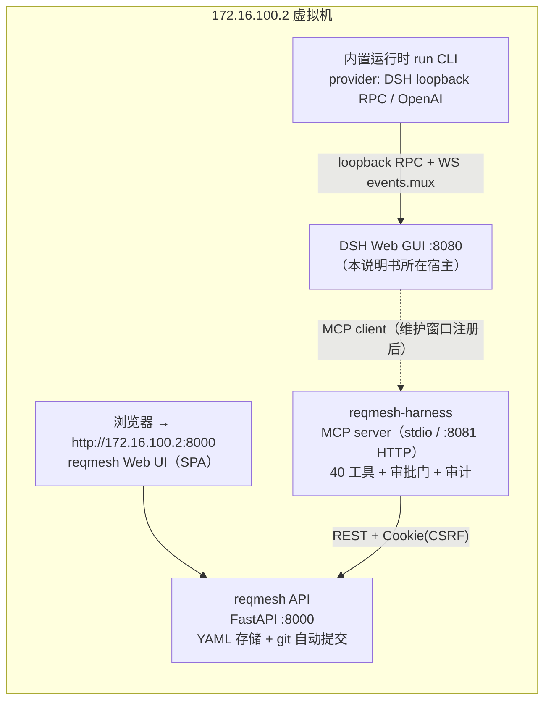
```mermaid
graph LR
    subgraph VM["172.16.100.2 虚拟机"]
        UI["浏览器 → http://172.16.100.2:8000<br/>reqmesh Web UI（SPA）"]
        API["reqmesh API<br/>FastAPI :8000<br/>YAML 存储 + git 自动提交"]
        H["reqmesh-harness<br/>MCP server（stdio / :8081 HTTP）<br/>40 工具 + 审批门 + 审计"]
        R["内置运行时 run CLI<br/>provider: DSH loopback RPC / OpenAI"]
        DSH["DSH Web GUI :8080<br/>（本说明书所在宿主）"]
    end
    UI --> API
    H -->|"REST + Cookie(CSRF)"| API
    R -->|"loopback RPC + WS events.mux"| DSH
    DSH -.->|"MCP client（维护窗口注册后）"| H
```

| 组件 | 地址/命令 | 说明 |
|---|---|---|
| reqmesh UI + API | http://172.16.100.2:8000 | 单源部署：API 同时服务前端静态文件 |
| reqmesh-harness MCP | stdio；HTTP transport 经 `run_server.sh`（8081） | serverName=`reqmesh` |
| 内置运行时 | `reqmesh-harness run "<任务>"` | 默认 provider=本地 DSH |
| 白名单 | `~/.config/reqmesh-harness/approvals.toml` | fail-closed |
| 审计日志 | `~/.local/state/reqmesh-harness/audit.jsonl` | append-only，JSONL |
| 会话/run 状态 | `~/.local/state/reqmesh-harness/{session.json,runs/}` | XDG state |

**账号一览（本包已预置）**

| 账号 | 角色 | 凭据位置 | 用途 |
|---|---|---|---|
| `admin` | admin | `reqmesh/.rt-admin-pw`（首次登录会要求改密） | 全功能/系统管理 |
| `reqmesh-harness` | maintainer | `reqmesh-harness/.env`（0600） | harness 服务账号（最小权限，P2 决策） |
| `yugj` | contributor | 会话历史（P1 冒烟用） | 早期冒烟账号 |

---

## 2. 环境启动/停止速查

```bash
# reqmesh（已在跑；重启前先杀旧进程）
pkill -f "uvicorn app.main" && cd reqmesh/backend && \
RT_PROFILE=personal RT_STATIC_DIR=$PWD/../frontend/dist RT_DATA_ROOT=$PWD/../data/projects \
RT_SECRET=$(cat ../.rt-secret) RT_ADMIN_PASSWORD=$(cat ../.rt-admin-pw) \
RT_BASE_URL=http://172.16.100.2:8000 \
.venv/bin/python -m uvicorn app.main:app --host 0.0.0.0 --port 8000 &

# harness MCP（streamable-HTTP :8081，含端口占用预检；systemd 模板见 docs/deployment.md）
cd reqmesh-harness && ./scripts/run_server.sh start|status|stop

# harness 测试基线（全程离线，约 17s）
cd reqmesh-harness && uv run pytest -q        # 533 passed, 3 skipped, 2 deselected
uv run python evals/run_offline.py            # 5/5 全绿
```

---

## 3. reqmesh 手动测试（UI 为主）

以下每节：**目的 → 步骤（UI 点击路径）→ 预期结果**。截图均为本包真实实例
（项目 `cessna-172`，57 条内置需求 + P2/P3 冒烟残渣，total=61）。

### 3.1 登录与用户管理

**目的**：验证登录、会话、用户管理（管理员专属）。

1. 浏览器打开 http://172.16.100.2:8000 —— 未登录时显示登录页：

   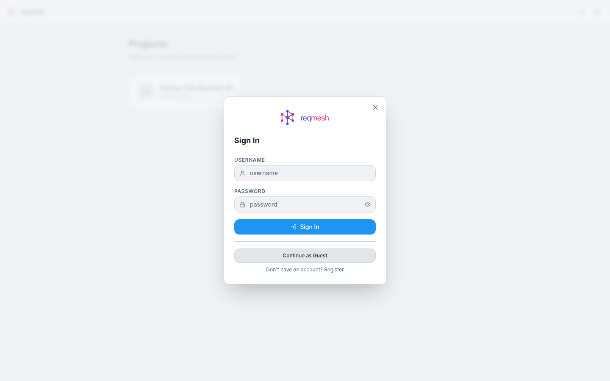

2. 用 `admin` + `reqmesh/.rt-admin-pw` 中的密码登录。**预期**：进入项目列表；首次登录会提示修改密码（改完记到安全位置）。
3. 左侧导航 `Users`（仅 admin 可见）：

   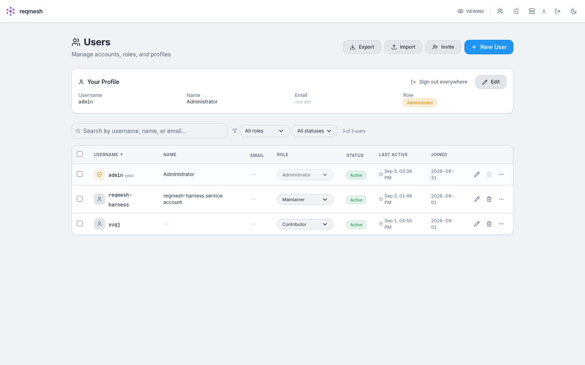

4. **预期**：可看到 `admin`/`reqmesh-harness`/`yugj` 等账号与角色；可导出 CSV、导入 CSV、邀请用户（邀请需 SMTP，未配置时仅本地生效）、禁用/解锁/强制下线单个用户。

**API 等价验证（curl）**

```bash
PW=$(cat reqmesh/.rt-admin-pw)
curl -c /tmp/jar -X POST http://172.16.100.2:8000/api/auth/login \
     -H "Content-Type: application/json" -d "{\"username\":\"admin\",\"password\":\"$PW\"}"
# → 200 {"username":"admin","role":"admin","csrf_token":"...","password_change_required":true}
curl -b /tmp/jar http://172.16.100.2:8000/api/auth/whoami   # → 200 admin/admin
```

### 3.2 项目

**目的**：项目列表/创建/设置。

1. 登录后首页为项目列表：**预期**：`Cessna 172S Skyhawk SP`（cessna-172）。

   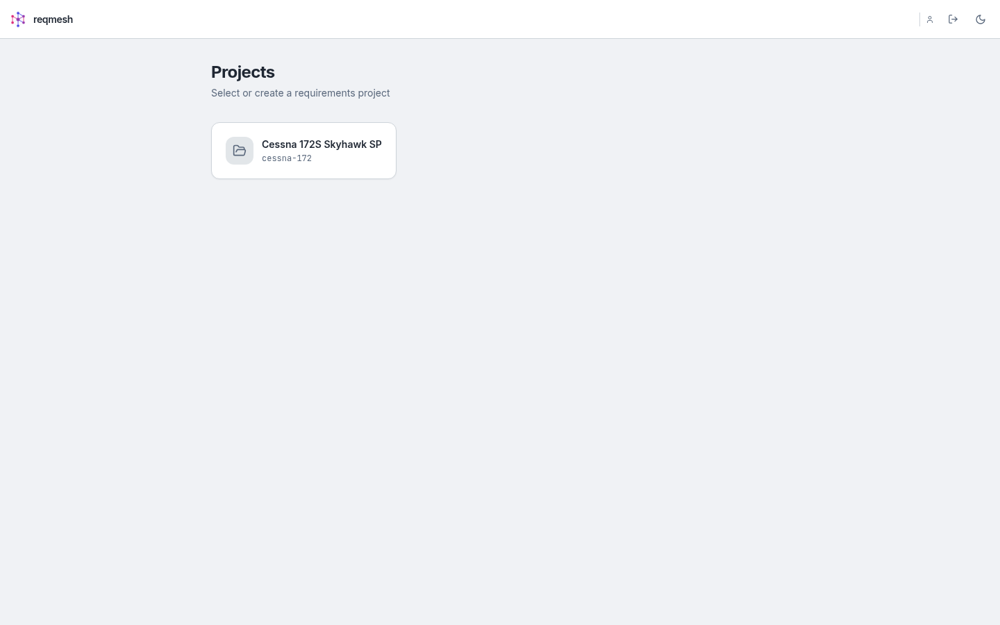

2. 点 `New Project` 创建 `manual-test`（可稍后删除）。**预期**：新项目出现，磁盘生成 `reqmesh/data/projects/manual-test/`（`_meta.yaml` + 实体目录），git 自动提交。
3. 进入 cessna-172 的概览页（`/project/cessna-172`）：

   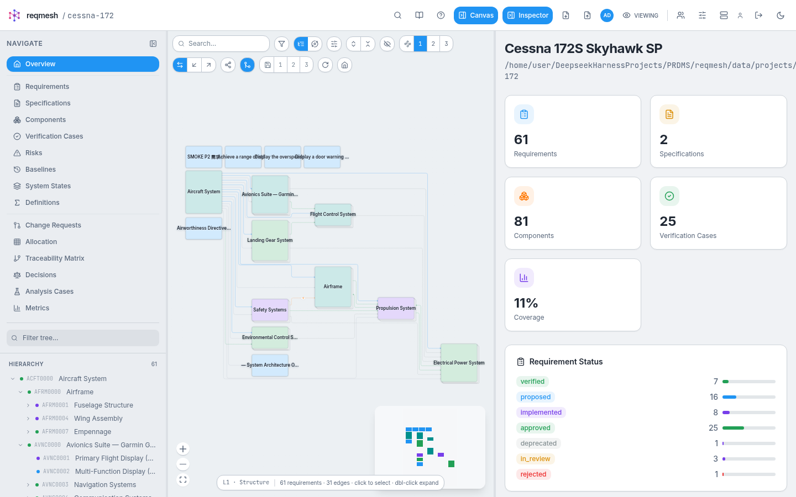

   **预期**：看到需求树/统计卡片/最近活动；`Project Settings` 里可改工作流状态、质量配置（quality config）、风险矩阵权重。

### 3.3 需求（核心功能）

**目的**：需求的增删改查、树、搜索、质量评分、审查、历史、参数。

1. `Requirements` 页（左侧导航）：**预期**：左侧树 + 中间列表/画布 + 右侧检查器三栏。

   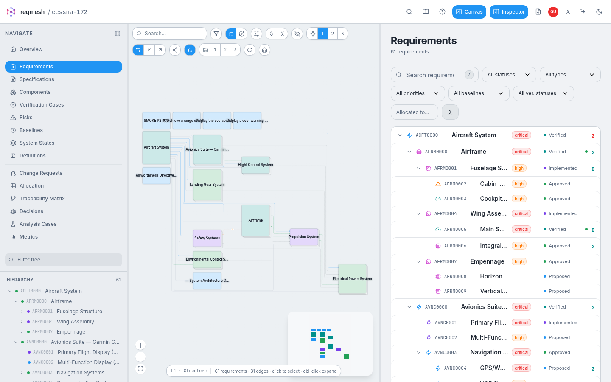

2. 点开任一需求（如 `ACFT0000`）进入详情：

   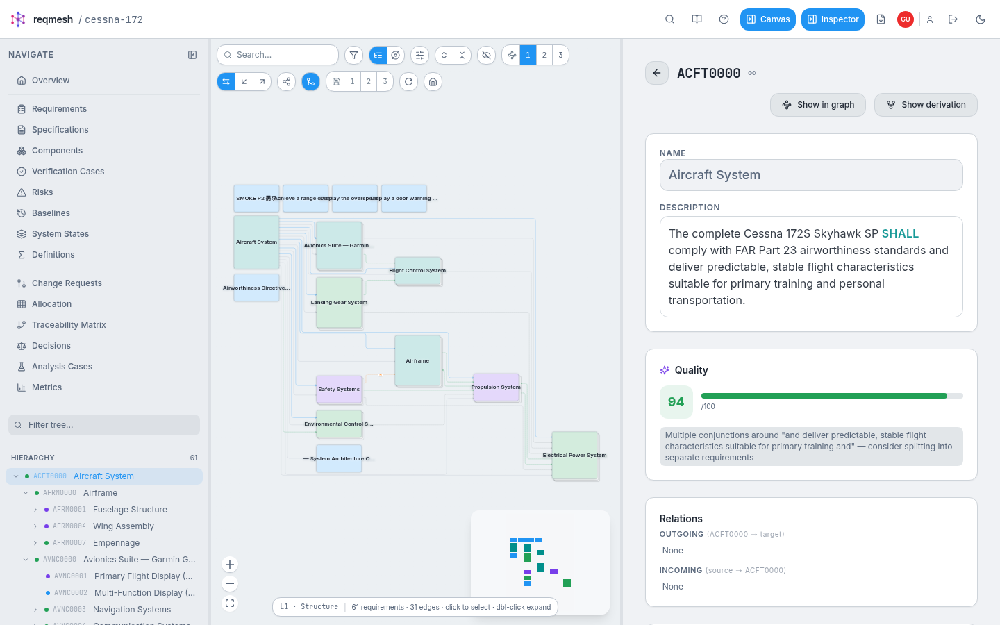

   **预期**：右侧检查器显示描述/状态/优先级/属性/关系/验证用例/分配组件/质量分（含具体写作反馈）。
3. `Canvas` 图形视图：**预期**：需求节点图可拖拽、缩放、点击节点联动检查器。

   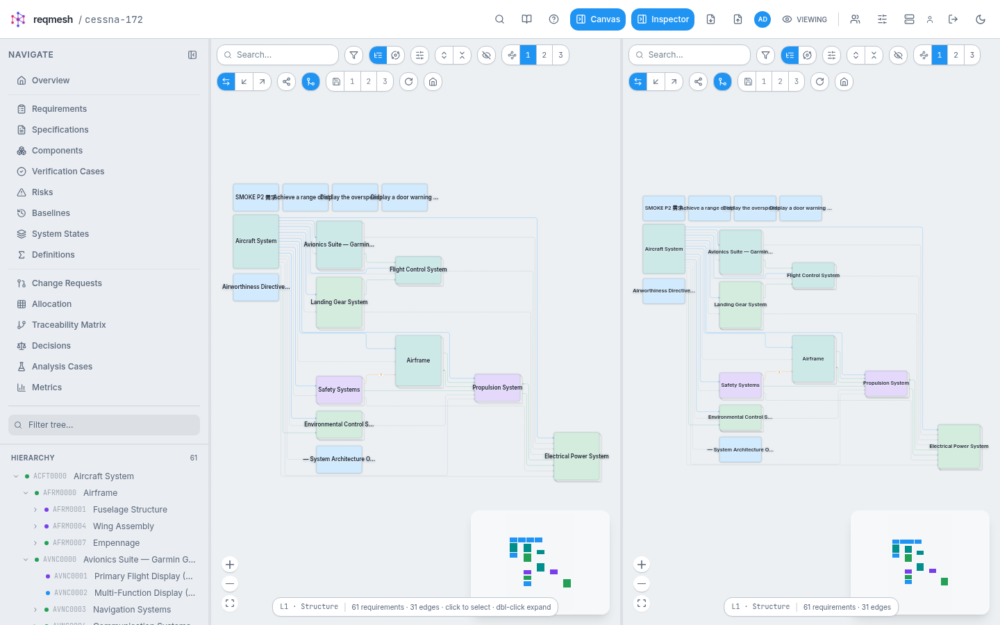

4. **创建需求**：`New Requirement` → 填 name/description/type/priority → 保存。
   **预期**：新需求出现在树中；故意写弱词（如 "should"、"TBD"）时质量分下降并给出 lint 反馈。
5. **编辑**：改描述 → 保存。**预期**：git 自动提交新增一条；历史面板出现该字段的 before/after。
6. **审查**：详情页点 `Review`。**预期**：该需求从「未评审列表」消失；再改规范性内容后审查失效（指纹机制，审查状态变为 stale）。
7. **删除**：Delete → 若有引用（验证用例/关系指向它），**预期**：被拦截并列出引用者（error envelope 带 referrer 列表）。
8. **级联/拆分**：详情页 `Cascade`（从父需求派生子需求）。**预期**：生成子需求并挂接 parent。

**API 等价验证**

```bash
curl -b /tmp/jar "http://172.16.100.2:8000/api/projects/cessna-172/requirements?limit=3"
# → {"items":[{...}],"total":61,...}
curl -b /tmp/jar http://172.16.100.2:8000/api/projects/cessna-172/requirements/tree
curl -b /tmp/jar "http://172.16.100.2:8000/api/projects/cessna-172/search?q=engine"
```

### 3.4 组件与分配矩阵

**目的**：物理/功能分解树、组件-需求满足关系（satisfies）、分配矩阵。

1. `Components` 页：**预期**：组件树（system→subsystem→assembly→part）+ 数量/件号/供应商字段。

   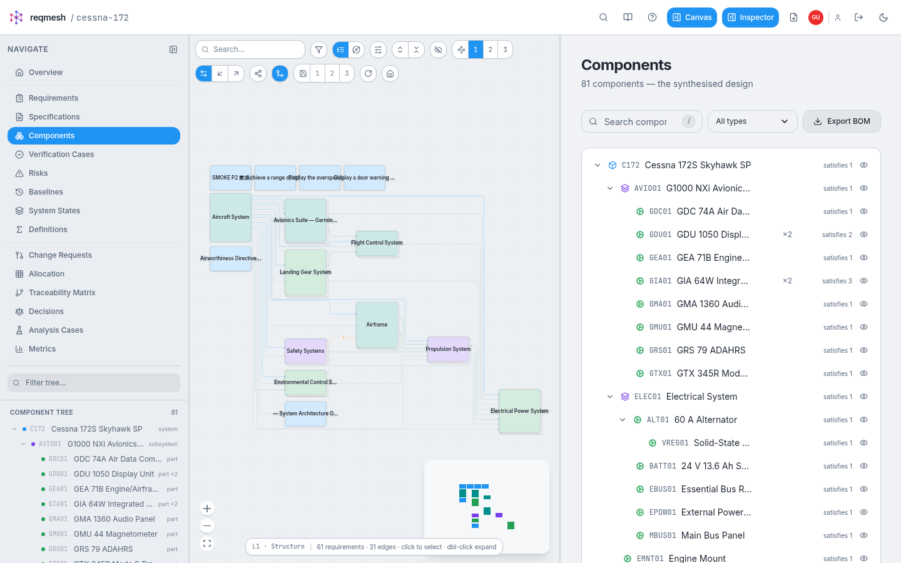

2. 组件详情：绑定 `satisfies` 需求（表示该组件满足哪些需求）。
3. `Allocation` 页：**预期**：需求×组件分配矩阵，行=需求列=组件，勾选即分配；`Export BOM` 可导出物料清单。

   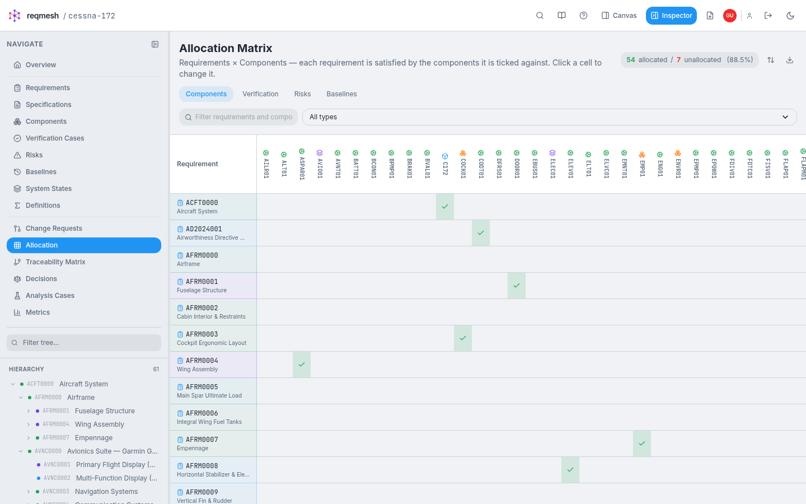

### 3.5 验证用例

**目的**：验证/确认用例（verification vs validation）、执行记录。

1. `Verification` 页：

   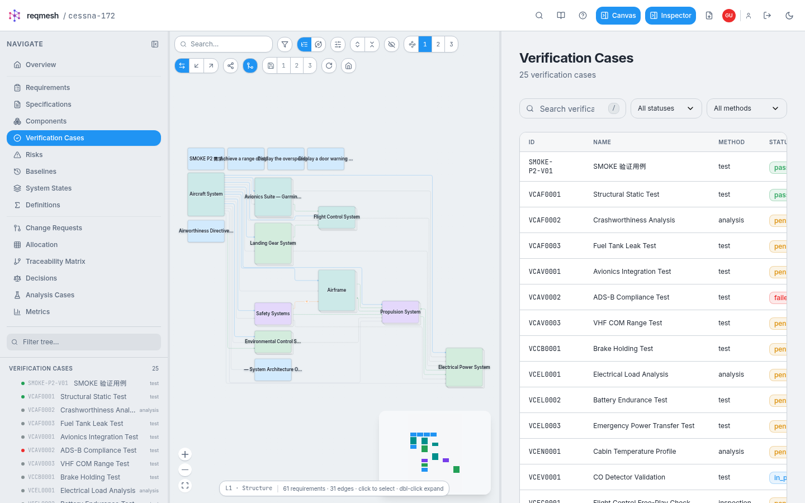

2. 创建用例（方法=test/analysis/demonstration/inspection、环境、判定门 decision gate）→ 打开用例点 `Run` 填 status（passed/failed/inconclusive）+ 备注。
   **预期**：`execution_history` 追加一条带时间戳与原因；用例状态随之更新。
3. 用例详情可绑定 `verified_requirements`（该用例验证哪些需求），需求侧会自动出现 `verified_by` 关系。

### 3.6 风险

**目的**：风险条目、二维风险矩阵（severity×likelihood）、bingo 网格、双向需求关联（threatens/mitigated-by）。

1. `Risks` 页：**预期**：风险列表 + 可调权重的矩阵（项目设置里可重调）。

   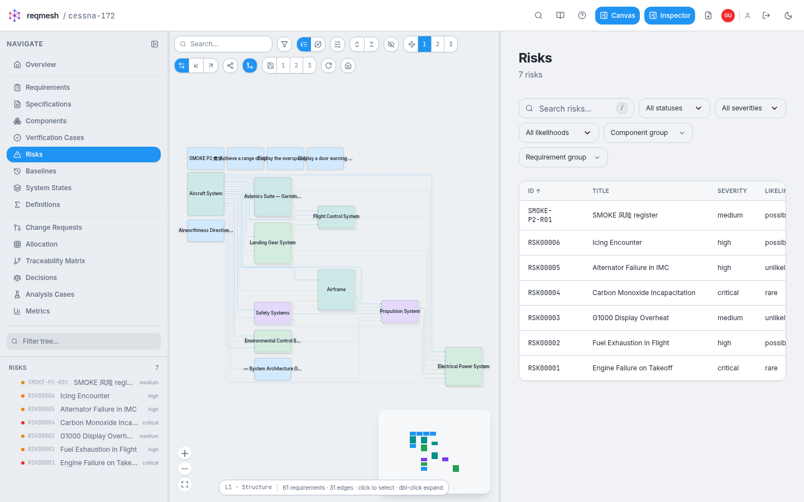

2. 新建风险（failure_mode/effect/cause/severity/likelihood）→ **预期**：矩阵对应单元格 +1；bingo 网格计数变化。
3. 风险与需求关联：风险详情里关联「被哪条需求缓解」；需求详情里出现「threatens/缓解」关系。

### 3.7 基线

**目的**：有序里程碑、冻结/差异对比。

1. `Baselines` 页：**预期**：基线列表（编号/日期/序列）。

   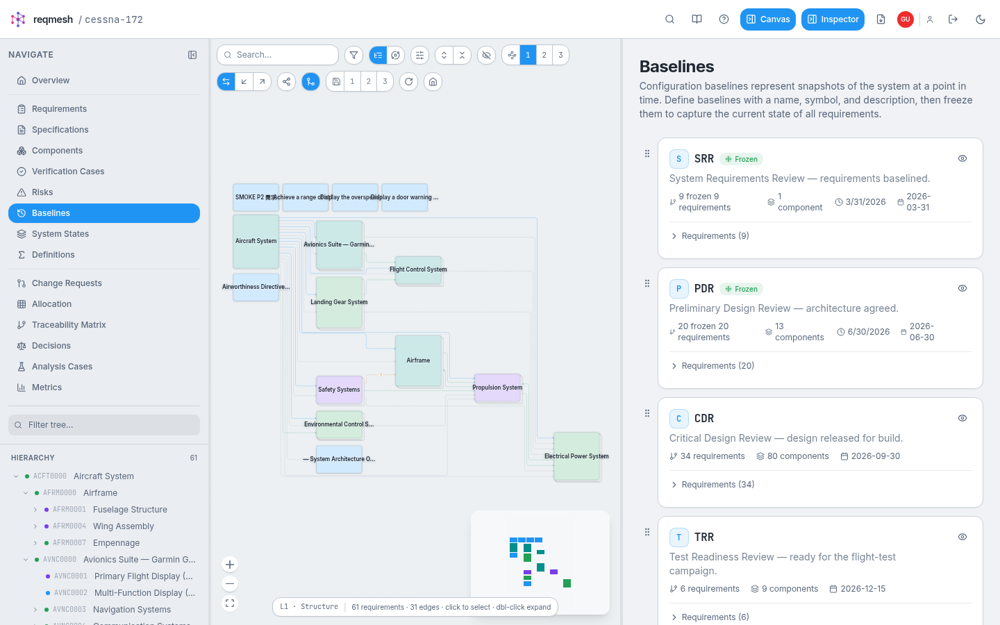

2. 新建基线（名称+日期）→ `Freeze`。**预期**：基线内容快照冻结。
3. `Diff`：改一条需求后再 diff。**预期**：显示该需求的前后差异（redline）。

### 3.8 变更请求

**目的**：正式变更控制：提出（可含新需求）→ 红头预览 → 执行/拒绝；防覆盖保护。

1. `Change Requests` 页：**预期**：列表 + 新建向导。

   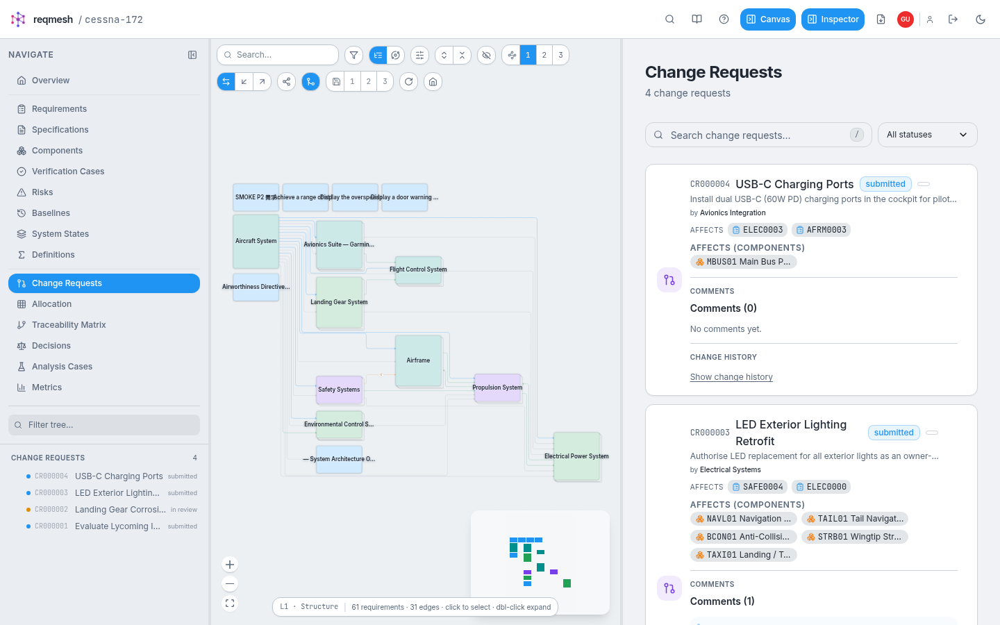

2. 新建 CR：对一个需求提出改前/改后内容（或提出新需求）→ 保存。**预期**：`Redline` 预览显示前后差异。
3. `Execute`。**预期**：变更落地、git 提交。**负例**：执行前先手动改掉目标需求 → 再次 Execute **应被拒绝**（"target changed since raised"，防止覆盖未见的编辑）。

### 3.9 追踪与覆盖

**目的**：追踪矩阵、覆盖率、缺口分析、可疑链接。

1. `Traces` 页：**预期**：实体间链接矩阵，可按 collection 过滤。

   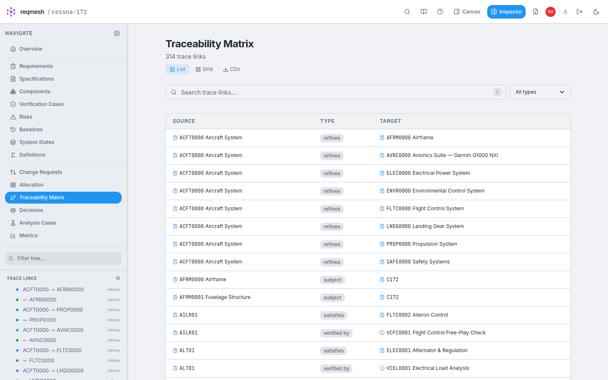

2. 项目概览/`Metrics` 内查看 `Coverage` 与 `Gap Analysis`。
   **预期（本包基线，P4 快照）**：coverage total=59（shallow 48 / deep 42 / 81-71）；gap=40；traces=9；unreviewed=2；allocation 41 行（40 已分配 +1）；61 行需求中 7 行未分配。
3. **可疑链接**：编辑某需求后，`Suspect Links` 出现指纹失配的链接（reviewed_fingerprint 机制），需重新审查。

### 3.10 其他实体页（规格/定义/系统状态/决策/分析案例/评论）

| 页面 | 测试要点 | 预期 | 截图 |
|---|---|---|---|
| Specifications | 创建规格文档并与需求关联 | 需求侧出现引用关系 | — |
| Definitions | 术语表增删 | 术语在需求/报告中可用 | 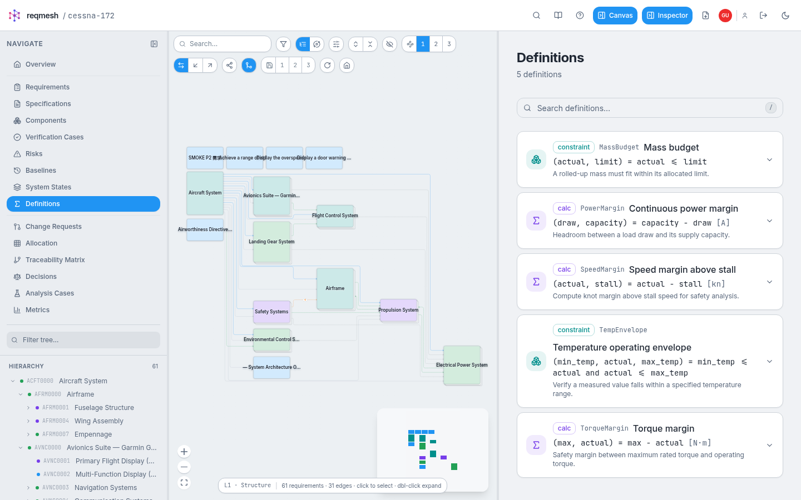 |
| System States | 系统状态机节点、排序 | 需求可挂 system_states | 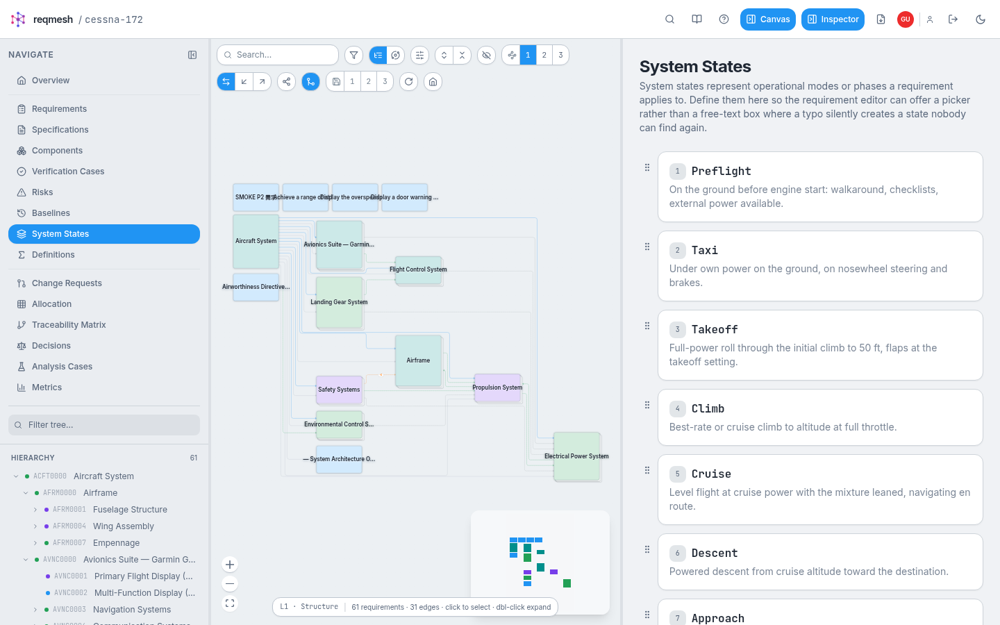 |
| Decisions | 决策记录（问题/选项/结论） | 与 Pugh 矩阵联动 | 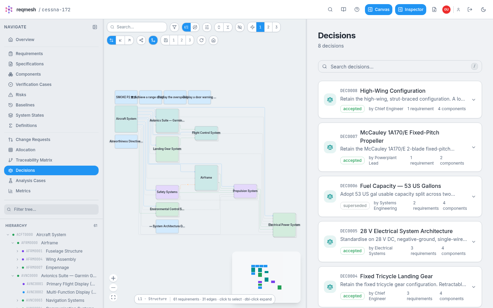 |
| Analysis Cases | 分析案例 + `Run` | 与验证用例同构，execution_history 追加 | 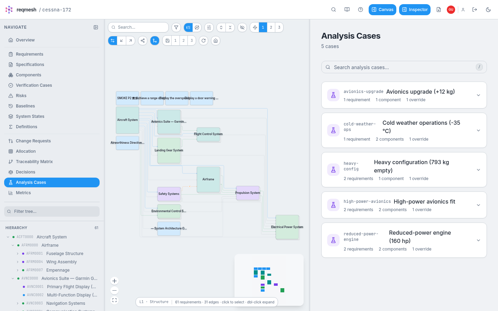 |
| Comments | 任意实体下评论/解决 | 评论出现在实体详情；PATCH resolved | — |

### 3.11 参数化评估（what-if）

**目的**：SysML 风格参数、约束、边距计算、实时试算预览。

1. 需求详情里给需求加 `parameters`（如 max_speed=140, unit=kts）与 `constraints`（如 `max_speed <= 180`）。
2. `Evaluation` 面板：**预期**：约束求值 verdict（pass/fail/margin）。
3. **What-if**：改一个参数值（不提交）→ **预期**：下游需求动画式重算、画布高亮受影响节点；`Confirm` 才落库，`Restore` 还原，未确认前无 git 提交。

### 3.12 搜索 / 指标 / 发布导出

1. `Search` 页：全文搜索（可限 kind）。**预期**：命中高亮、跨实体聚合。

   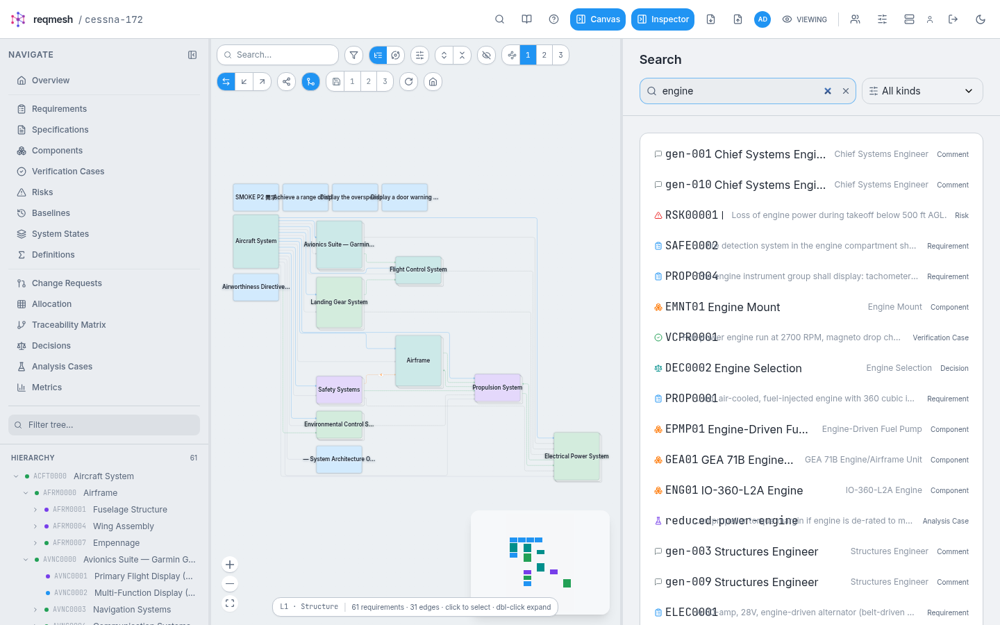

2. `Metrics` 页：**预期**：需求/覆盖/风险/活动图表（Recharts 渲染）。

   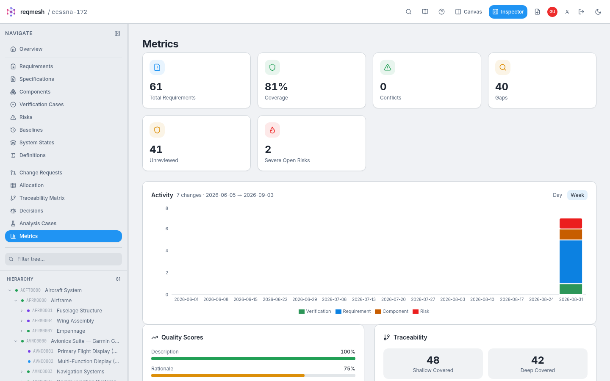

3. `Publish` 页：**预期**：可按需求组/组件/基线**交集**范围导出（"SRR 冻结的全部内容"），格式 ReqIF 1.2 / SysML v2 / CSV / TSV / XLSX / PDF；PDF 依赖 tectonic（未装时给出提示）。

   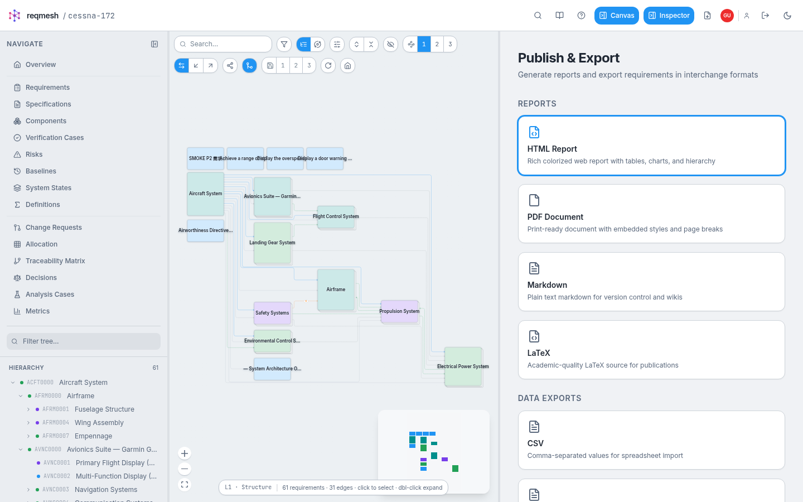

### 3.13 系统管理（admin）

1. `Settings`（admin）：**预期**：实例级配置（注册开关/邮件/离线上线模式/git 推送等）。

   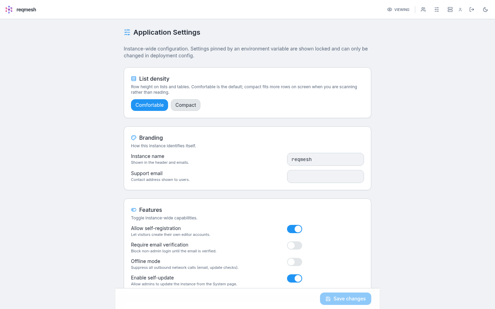

2. `System`（admin）：**预期**：版本/依赖健康/更新检查/重启按钮/演示项目重置（reseed）。

   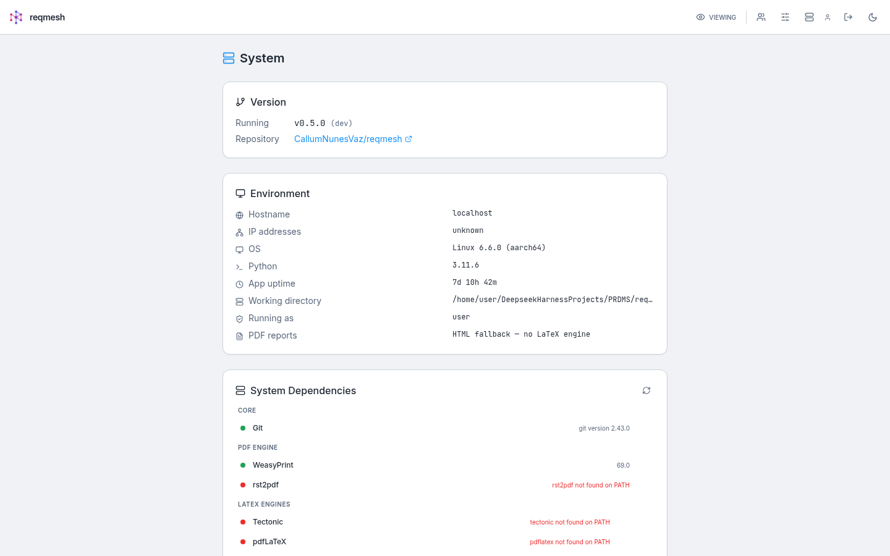

3. Git 集成（项目设置内）：`git status/log` 面板、remote 配置、push 测试；自动提交开关。

---

## 4. reqmesh-harness 手动测试（CLI / MCP）

### 4.0 准备

```bash
cd reqmesh-harness
ls .env                       # 服务账号凭据（REQMESH_USERNAME=reqmesh-harness 等，0600）
uv run reqmesh-harness approvals list   # 初始应为空（fail-closed）
```

### 4.1 认证与只读工具

harness 的一切操作走 `AuthSession`（登录 → cookie+CSRF 持久化到 XDG state）。用一条 MCP 调用验证即可（§4.5）；工具清单（40 个）：

| 域 | 工具 |
|---|---|
| 认证/项目 | whoami, list_projects |
| 需求 | list_requirements, get_requirement, search_requirements, get_requirement_tree, get_unreviewed_requirements, get_item_history, list_comments |
| 组件/报告 | list_components, list_baselines, list_change_requests, get_project_report |
| 追踪/覆盖 | get_traces, get_coverage, get_gap_analysis, get_allocation_matrix, get_suspect_links |
| 风险/决策 | list_risks, get_risk_matrix, list_decisions, list_definitions, list_specifications, list_verification_cases, list_analysis_cases |
| 写（12） | create_requirement, update_requirement, set_relations, set_allocation, create_component, update_component, create_verification_case, update_verification_case, run_verification, create_risk, create_comment, review_item |
| 复合技能（3） | draft_requirement（NL→EARS→lint→落库）, get_requirement_quality, get_traceability_gap_report |

### 4.2 写工具与审批门（P2 核心）

**fail-closed 白名单**：不在 `approvals.toml` 的写工具一律拒绝。

```bash
# 1) 空白名单：任何写工具被拒
uv run reqmesh-harness approvals list                      # 空

# 2) 加白名单（MUTATE 必须指定项目；DRAFT 可通配）
uv run reqmesh-harness approvals add create_requirement --project cessna-172 --yes
uv run reqmesh-harness approvals add update_requirement --project cessna-172 --yes
uv run reqmesh-harness approvals list

# 3) dry-run（不落库、不产生 git 提交，但照跑审批门与审计）
#    在 MCP 调用里传 dry_run=true → 返回 {"dry_run":true,"would_send":{...},"checks":[...]}

# 4) 审计：每次调用一行 JSONL（含 denied/dry_run/真实写）
tail -5 ~/.local/state/reqmesh-harness/audit.jsonl
```

**验收要点**：未批准写操作被阻断（ApprovalDeniedError + fix_hint）；dry_run 零副作用；
审计行含 tool/project/status 等字段；`approvals remove` 后立即失效（每次调用重读文件）。

### 4.3 复合技能三件套

```bash
# draft_requirement：一句话 → EARS 措辞 → 本地 lint（≤3 轮）→ 落库（走审批门）
#   参数：project_id, nl_text, 可选 template/type/priority；dry_run 只预览
# get_traceability_gap_report：六源聚合缺口报告（每条缺口带建议动作）
# get_requirement_quality：需求级质量分（/quality 两态过滤）
```

**验收要点**（P3/P4 基线）：`draft_requirement("系统应在500ms内完成认证", project_id="cessna-172", dry_run=true)`
→ EARS 五句式之一（The system shall … within 500 ms）+ `lint_score=100` + `rounds=1`；
`get_traceability_gap_report` 的缺口并集 == 六源各自缺口的并集（无丢失、无编造），
每条 action 的 `tool_hint` 都指向既有写工具名。

### 4.4 MCP 双 transport

**stdio 手工验证（零依赖，JSON-RPC）**

```bash
cd reqmesh-harness
printf '%s\n' \
 '{"jsonrpc":"2.0","id":1,"method":"initialize","params":{"protocolVersion":"2025-03-26","capabilities":{},"clientInfo":{"name":"manual","version":"1"}}}' \
 '{"jsonrpc":"2.0","method":"notifications/initialized"}' \
 '{"jsonrpc":"2.0","id":2,"method":"tools/list"}' \
 | .venv/bin/reqmesh-harness --transport stdio | tail -1
# → 40 个工具（name/title/annotations.readOnlyHint + meta.domain/level）
```

**streamable-HTTP（8081）**

```bash
./scripts/run_server.sh start
curl -s http://127.0.0.1:8081/mcp -X POST -H "Content-Type: application/json" \
  -H "Accept: application/json, text/event-stream" \
  -d '{"jsonrpc":"2.0","id":1,"method":"initialize","params":{"protocolVersion":"2025-03-26","capabilities":{},"clientInfo":{"name":"manual","version":"1"}}}'
# → 200，响应含服务器信息（SSE 或 JSON，取决于 Accept）
```

**MCP Inspector（可选，需联网）**

```bash
npx @modelcontextprotocol/inspector uv run reqmesh-harness --transport stdio
# 浏览器打开 → 工具列表 40 项 → 任意 READ 工具填入 project_id=cessna-172 调用
```

### 4.5 内置运行时 run CLI

```bash
# 离线演示（provider=fake，不发网络请求，适合无 DSH/无 key 环境）
uv run reqmesh-harness run "列出 cessna-172 的覆盖率" --project cessna-172 --provider fake

# 真实 provider（默认 dsh：127.0.0.1:8080 loopback RPC + WS events.mux 流式）
uv run reqmesh-harness run "给 cessna-172 新增一条需求：系统应在 500 ms 内完成认证" \
     --project cessna-172 --yes --show-reasoning --max-rounds 8
# --yes：denied 自动维护白名单并重试；--resume RUN_ID：续跑两分支（见 P5 spec ⑤）
```

**验收要点**：fake provider 下任务可离线完成且工具序列可断言；dsh provider 下终端流式
输出（chunk 事件）、审批门 denied→确认中继→白名单维护→重试 的时序、审计双行行为。
> dsh provider 依赖 DSH 宿主把 `mcp__reqmesh__*` 工具注册进会话（维护窗口执行
> `scripts/dsh_register.sh --apply` 后重启 8080 宿主；注册前 `--check` 可验证前置）。

### 4.6 测试基线与 evals

```bash
cd reqmesh-harness
uv run pytest -q                 # 期望：533 passed, 3 skipped, 2 deselected（全离线）
uv run python evals/run_offline.py   # 期望：5/5 全绿（G1–G5，断言工具序列/审计/最终状态）
uv run python evals/run_offline.py --selftest   # 自检模式
# 网络冒烟（需运行中的 reqmesh 实例；逐个脚本）：
uv run python scripts/smoke_p1.py   # P1: requirements total / coverage / gap / traces
# REQMESH_P5_SMOKE_B=1 uv run python scripts/smoke_p5.py   # P5 B 段（DSH 注册前置满足后）
```

---

## 5. 故障排查

| 症状 | 排查 |
|---|---|
| 8000 端口 404 `{"detail":"Not Found"}` | 实例没带 `RT_STATIC_DIR`（UI 未被服务）；按 §2 重启 |
| 浏览器登录后立即掉线 | 实例是 `team` 姿态（`Secure` cookie 在纯 HTTP 下被浏览器丢弃）；改用 `personal` 或加 `RT_COOKIE_SECURE=false` |
| 写工具被拒 `ApprovalDeniedError` | `approvals add <tool> --project <pid>`；fix_hint 会给出精确命令 |
| curl 写请求 403 CSRF | 带上登录时返回的 `X-CSRF-Token` 头（值为 `csrftoken` cookie） |
| run 卡在等待 | dsh provider 依赖 8080 宿主；检查 `REQMESH_PROVIDER` 与宿主状态；离线验证用 `--provider fake` |
| 测试失败数不为 533 | 检查 `uv sync` 后重跑；网络冒烟需实例在跑 |

---

## 附录 A：reqmesh API 端点速查

完整端点表见 `reqmesh/docs/api.md`（约 180 个端点）。手动测试常用：

| 方法+路径 | 用途 |
|---|---|
| POST `/api/auth/login` `/api/auth/logout` | 会话 |
| GET/POST `/api/projects` | 项目 |
| GET/POST `/api/projects/{pid}/requirements`，GET/PUT/DELETE `.../requirements/{rid}` | 需求 CRUD |
| POST `.../requirements/{rid}/review` | 审查 |
| GET `.../requirements/{rid}/history/{eid}` + POST `.../restore` | 历史/恢复 |
| GET/POST `.../components`，GET `.../components/tree` | 组件 |
| GET `/api/projects/{pid}/coverage` `/gap-analysis` `/traces` `/suspect-links` | 追踪覆盖 |
| GET `/api/projects/{pid}/quality` `/metrics` `/validate` | 质量/指标 |
| POST `.../change-requests/{crid}/execute` `/reject`，GET `/redline` | 变更控制 |
| POST `.../baselines/{name}/freeze`，GET `/diff` | 基线 |
| GET `.../evaluation`，POST `.../evaluation/impact` | 参数化 |
| POST `.../publish`，GET `.../publish/download` | 发布导出 |
| POST `.../import` | ReqIF/SysML/CSV/XLSX 导入 |

写请求（POST/PUT/PATCH/DELETE）必须带 `X-CSRF-Token` 头；PUT=部分更新（显式 null 清字段）。

## 附录 B：关键文件位置

| 文件 | 内容 |
|---|---|
| `reqmesh/.rt-secret` / `.rt-admin-pw` | JWT 密钥 / admin 初始密码（0600） |
| `reqmesh/data/projects/` | 项目数据（每个实体一个 YAML，git 自动提交） |
| `reqmesh-harness/.env` | 服务账号凭据 |
| `reqmesh-harness/dist/` | v0.2.0 发布产物 |
| `~/.config/reqmesh-harness/approvals.toml` | 审批白名单 |
| `~/.local/state/reqmesh-harness/audit.jsonl` | 工具级审计 |
| `docs/smoke/*.md` | P1–P5 冒烟实测记录（含基线数字与残渣清单） |

## 附录 C：术语

见仓库根 `CONTEXT.md`。要点：`session` 专指运行时会话；工程对话称「工作会话」
（需求/开发）；「审批门」=approval gate；「预览」=dry-run（不写库）。
